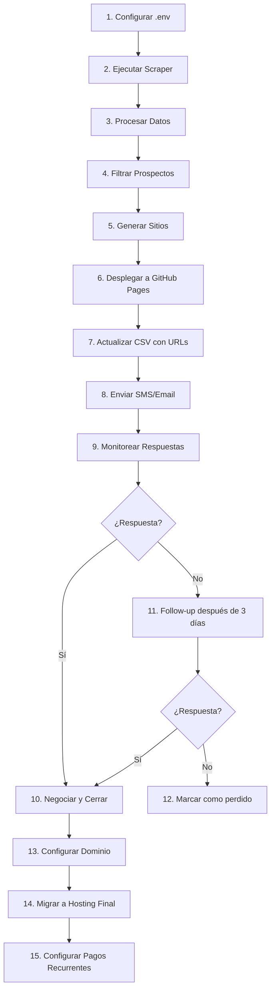

# Plan de Automatización Integral
## Sistema de Ventas de Sitios Web a Negocios Locales

---

## Índice
1. [Arquitectura General del Sistema](#1-arquitectura-general)
2. [Módulo 1: Scraping de Google Maps](#2-módulo-1-scraping)
3. [Módulo 2: Procesamiento y CSV](#3-módulo-2-procesamiento)
4. [Módulo 3: Generador de Sitios Estáticos](#4-módulo-3-generador)
5. [Módulo 4: Despliegue Automatizado](#5-módulo-4-despliegue)
6. [Módulo 5: Sistema de Mensajería](#6-módulo-5-mensajería)
7. [Módulo 6: Flujo de Cierre](#7-módulo-6-cierre)
8. [Stack Tecnológico](#8-stack-tecnológico)
9. [Estructura de Archivos del Proyecto](#9-estructura-archivos)

---

## 1. Arquitectura General del Sistema

### Diagrama de Flujo

```
┌─────────────────────────────────────────────────────────────────────────────┐
│                           SISTEMA DE AUTOMATIZACIÓN                          │
├─────────────────────────────────────────────────────────────────────────────┤
│                                                                              │
│  ┌──────────────┐    ┌──────────────┐    ┌──────────────┐    ┌──────────┐  │
│  │   SCRAPING   │───▶│    CSV/DB    │───▶│  GENERADOR   │───▶│ GITHUB   │  │
│  │  GOOGLE MAPS │    │  PROSPECTOS  │    │   SITIOS     │    │  PAGES   │  │
│  └──────────────┘    └──────────────┘    └──────────────┘    └──────────┘  │
│         │                                      │                  │        │
│         ▼                                      ▼                  ▼        │
│  ┌──────────────┐    ┌──────────────┐    ┌──────────────┐    ┌──────────┐  │
│  │  FILTRADO    │    │   SELECCIÓN  │    │    DEMO      │    │  URL     │  │
│  │  SIN WEB     │    │  OBJETIVOS   │    │   EN VIVO    │    │ TEMPORAL │  │
│  └──────────────┘    └──────────────┘    └──────────────┘    └──────────┘  │
│                                                           │                 │
│                                                           ▼                 │
│                                              ┌──────────────────────┐       │
│                                              │   MENSAJERÍA         │       │
│                                              │   (SMS/Email)        │       │
│                                              └──────────────────────┘       │
│                                                       │                     │
│                                                       ▼                     │
│                                              ┌──────────────────────┐       │
│                                              │   SEGUIMIENTO        │       │
│                                              │   Y CIERRE           │       │
│                                              └──────────────────────┘       │
│                                                                              │
└─────────────────────────────────────────────────────────────────────────────┘
```

### Componentes Principales

| Componente | Función | Tecnología |
|------------|---------|------------|
| **Scraper** | Extraer datos de Google Maps | Python + SerpAPI/MCP |
| **Procesador** | Filtrar y organizar prospectos | Python + Pandas |
| **Generador** | Crear sitios estáticos personalizados | Claude Code + Templates |
| **Desplegador** | Publicar en GitHub Pages | Git + GitHub CLI |
| **Mensajería** | Enviar SMS/Email automatizados | Twilio/SendGrid |
| **CRM Lite** | Seguimiento de prospectos | JSON/SQLite |

---

## 2. Módulo 1: Scraping de Google Maps

### 2.1. Opciones de Scraping Disponibles

#### Opción A: SerpAPI (Recomendada - Estable)
```bash
# Instalación
pip install google-search-results
```

**Ventajas:**
- API oficial y estable
- No requiere mantenimiento
- Datos estructurados consistentes
- 100 búsquedas gratis/mes

**Desventajas:**
- Costo: $50/mes para 5000 búsquedas
- Límite de velocidad

#### Opción B: MCP Web Search (Gratis - Experimental)
```javascript
// Disponible directamente en Claude Code
mcp__web-search-prime__webSearchPrime
```

**Ventajas:**
- Gratis
- Integración nativa con Claude
- Sin límites estrictos

**Desventajas:**
- Datos menos estructurados
- Puede requerir post-procesamiento

#### Opción C: Scraper Manual con Playwright
```bash
npm install playwright @playwright/test
```

### 2.2. Implementación con SerpAPI

#### Paso 1: Configuración
```bash
# Crear archivo de configuración
mkdir -p config
touch config/.env
```

**Archivo: `config/.env`**
```env
SERPAPI_KEY=tu_key_aqui
CATEGORIES=fence contractor,landscaping,roofing,plumbing,hvac
LOCATIONS=New Jersey,New York,Connecticut,Pennsylvania
MAX_RESULTS_PER_SEARCH=20
MIN_RATING=4.0
MIN_REVIEWS=10
```

#### Paso 2: Script de Scraping Principal

**Archivo: `src/scraper/google_maps_scraper.py`**
```python
#!/usr/bin/env python3
"""
Scraper de Google Maps para identificar negocios locales sin sitio web.
Extrae: nombre, dirección, teléfono, rating, reseñas, y verifica si tiene website.
"""

import os
import json
import time
from typing import List, Dict
from serpapi import GoogleSearch
from dotenv import load_dotenv

load_dotenv('config/.env')

class GoogleMapsScraper:
    """Scraper especializado para Google Maps"""

    def __init__(self):
        self.api_key = os.getenv('SERPAPI_KEY')
        self.categories = os.getenv('CATEGORIES').split(',')
        self.locations = os.getenv('LOCATIONS').split(',')
        self.max_results = int(os.getenv('MAX_RESULTS_PER_SEARCH', 20))

    def search_businesses(self, category: str, location: str) -> List[Dict]:
        """
        Busca negocios en una categoría y ubicación específicas.

        Args:
            category: Categoría de negocio (ej: "fence contractor")
            location: Ubicación (ej: "New Jersey")

        Returns:
            Lista de diccionarios con información de negocios
        """
        params = {
            "engine": "google_maps",
            "q": f"{category} in {location}",
            "type": "search",
            "api_key": self.api_key,
            "hl": "en",
            "ll": "@40.0583,-74.4057,11z", # Coordenadas NJ por defecto
        }

        try:
            search = GoogleSearch(params)
            results = search.get_dict()

            businesses = []

            # Extraer resultados locales
            if "local_results" in results:
                for place in results["local_results"][:self.max_results]:
                    business_data = self._extract_business_data(place, category)
                    businesses.append(business_data)

            # Obtener más resultados con paginación
            next_page_token = results.get("serpapi_pagination", {}).get("next_page_token")
            page = 0
            max_pages = 2  # Limitar a 2 páginas por búsqueda

            while next_page_token and page < max_pages:
                time.sleep(2)  # Respetar rate limits
                params["next_page_token"] = next_page_token

                search = GoogleSearch(params)
                results = search.get_dict()

                if "local_results" in results:
                    for place in results["local_results"][:self.max_results]:
                        business_data = self._extract_business_data(place, category)
                        businesses.append(business_data)

                next_page_token = results.get("serpapi_pagination", {}).get("next_page_token")
                page += 1

            return businesses

        except Exception as e:
            print(f"Error searching {category} in {location}: {e}")
            return []

    def _extract_business_data(self, place: Dict, category: str) -> Dict:
        """
        Extrae y estructura los datos relevantes de un negocio.

        Args:
            place: Datos crudos del lugar
            category: Categoría asignada

        Returns:
            Dict con datos estructurados
        """
        # Verificar si tiene sitio web
        website = place.get("website", "")
        has_website = bool(website)

        # Extraer teléfono principal
        phone = None
        if "phone" in place:
            phone = place["phone"]
        elif "phone_unformatted" in place:
            phone = place["phone_unformatted"]

        # Extraer coordenadas
        coordinates = place.get("gps_coordinates", {})
        lat = coordinates.get("latitude") if coordinates else None
        lng = coordinates.get("longitude") if coordinates else None

        return {
            "name": place.get("title", ""),
            "category": category,
            "address": place.get("address", ""),
            "city": place.get("city", ""),
            "state": place.get("state", ""),
            "zip_code": place.get("postal_code", ""),
            "phone": phone,
            "rating": place.get("rating", 0),
            "reviews_count": place.get("reviews", 0),
            "has_website": has_website,
            "website": website,
            "place_id": place.get("place_id", ""),
            "google_maps_url": place.get("place_link", ""),
            "latitude": lat,
            "longitude": lng,
            "description": place.get("description", ""),
            "type": place.get("type", ""),
        }

    def scrape_all_categories(self) -> List[Dict]:
        """
        Ejecuta scraping para todas las categorías y ubicaciones configuradas.

        Returns:
            Lista completa de todos los negocios encontrados
        """
        all_businesses = []

        for location in self.locations:
            for category in self.categories:
                print(f"Scraping: {category} in {location}...")
                businesses = self.search_businesses(category.strip(), location.strip())
                all_businesses.extend(businesses)
                print(f"  Found {len(businesses)} businesses")
                time.sleep(3)  # Pausa entre búsquedas

        return all_businesses

    def save_raw_data(self, businesses: List[Dict], filename: str = None):
        """
        Guarda los datos crudos en formato JSON.

        Args:
            businesses: Lista de negocios
            filename: Nombre del archivo (opcional)
        """
        if filename is None:
            timestamp = time.strftime("%Y%m%d_%H%M%S")
            filename = f"data/raw_businesses_{timestamp}.json"

        os.makedirs("data", exist_ok=True)

        with open(filename, 'w', encoding='utf-8') as f:
            json.dump(businesses, f, indent=2, ensure_ascii=False)

        print(f"Raw data saved to: {filename}")
        return filename


def main():
    """Función principal para ejecutar el scraper"""
    scraper = GoogleMapsScraper()
    businesses = scraper.scrape_all_categories()

    # Guardar datos crudos
    raw_file = scraper.save_raw_data(businesses)

    # Estadísticas rápidas
    total = len(businesses)
    without_website = [b for b in businesses if not b["has_website"]]
    with_good_rating = [b for b in without_website if b["rating"] >= 4.0]

    print(f"\n{'='*50}")
    print(f"SCRAPING COMPLETED")
    print(f"{'='*50}")
    print(f"Total businesses found: {total}")
    print(f"Without website: {len(without_website)} ({len(without_website)/total*100:.1f}%)")
    print(f"Without website + rating >= 4.0: {len(with_good_rating)}")
    print(f"Raw data: {raw_file}")
    print(f"{'='*50}\n")


if __name__ == "__main__":
    main()
```

#### Paso 3: Ejecutar el Scraper

```bash
# Crear estructura de directorios
mkdir -p src/scraper data raw processed

# Instalar dependencias
pip install google-search-results python-dotenv

# Ejecutar scraper
python src/scraper/google_maps_scraper.py
```

### 2.3. Implementación Alternativa con MCP

Si prefieres no usar SerpAPI, puedes usar el MCP Web Search disponible en Claude Code:

**Archivo: `src/scraper/mcp_scraper.py`**
```python
#!/usr/bin/env python3
"""
Scraper alternativo usando MCP Web Search.
Requiere ejecutar dentro de Claude Code.
"""

import json
import time
from typing import List, Dict

# NOTA: Este script debe ser ejecutado a través de Claude Code
# usando la herramienta mcp__web-search-prime__webSearchPrime

# Categorías a buscar
CATEGORIES = [
    "fence contractor New Jersey",
    "landscaping New Jersey",
    "roofing New Jersey",
    "plumbing New Jersey",
]

def extract_from_search_results(results: List[Dict]) -> List[Dict]:
    """
    Extrae información estructurada de resultados de búsqueda.
    """
    businesses = []

    for result in results:
        # Analizar snippet para detectar si tiene web
        snippet = result.get("snippet", "")
        has_www = "www." in snippet.lower() or "http" in snippet.lower()

        businesses.append({
            "name": result.get("title", "").split("-")[0].strip(),
            "address": "",  # Requiere procesamiento adicional
            "phone": extract_phone(snippet),
            "rating": 0,    # No disponible en búsqueda general
            "has_website": has_www,
            "website": result.get("link", ""),
            "description": result.get("snippet", ""),
        })

    return businesses

def extract_phone(text: str) -> str:
    """Extrae número de teléfono de un texto"""
    import re
    phone_pattern = r'\(?\d{3}\)?[-.\s]?\d{3}[-.\s]?\d{4}'
    match = re.search(phone_pattern, text)
    return match.group() if match else ""
```

---

## 3. Módulo 2: Procesamiento y CSV

### 3.1. Estructura del CSV Final

El CSV debe contener toda la información necesaria para generar los sitios y contactar a los prospectos.

**Columnas del CSV:**

| Columna | Descripción | Ejemplo |
|---------|-------------|---------|
| `prospect_id` | ID único del prospecto | `P001` |
| `business_name` | Nombre del negocio | `Mendoza Fence LLC` |
| `category` | Categoría principal | `Fence Contractor` |
| `address` | Dirección completa | `123 Main St, Newark, NJ 07102` |
| `city` | Ciudad | `Newark` |
| `state` | Estado | `NJ` |
| `zip_code` | Código postal | `07102` |
| `phone` | Teléfono principal | `+1 973-555-1234` |
| `rating` | Rating en Google | `4.8` |
| `reviews_count` | Número de reseñas | `127` |
| `has_website` | Tiene sitio web | `false` |
| `google_maps_url` | URL del perfil | `https://maps.google.com/...` |
| `latitude` | Latitud | `40.7357` |
| `longitude` | Longitud | `-74.1724` |
| `services_offered` | Servicios detectados | `Fence installation, repair` |
| `status` | Estado del prospecto | `pending/contacted/converted/lost` |
| `demo_url` | URL del sitio de demo | `https://mendoza-fence-demo.netlify.app` |
| `date_added` | Fecha de agregado | `2025-01-02` |
| `last_contacted` | Último contacto | `2025-01-03` |
| `email_sent` | Email enviado (bool) | `true` |
| `sms_sent` | SMS enviado (bool) | `false` |
| `notes` | Notas adicionales | `Interested in annual plan` |

### 3.2. Script de Procesamiento

**Archivo: `src/processor/process_prospects.py`**
```python
#!/usr/bin/env python3
"""
Procesador de datos de prospectos.
Filtra, limpia y genera el CSV final con información enriquecida.
"""

import os
import json
import pandas as pd
from datetime import datetime
from typing import List, Dict

class ProspectProcessor:
    """Procesa y enriquece datos de prospectos"""

    def __init__(self, raw_data_file: str):
        self.raw_data_file = raw_data_file
        self.businesses = self._load_raw_data()

    def _load_raw_data(self) -> List[Dict]:
        """Carga los datos crudos del archivo JSON"""
        with open(self.raw_data_file, 'r', encoding='utf-8') as f:
            return json.load(f)

    def filter_targets(self,
                       min_rating: float = 4.0,
                       min_reviews: int = 10,
                       require_no_website: bool = True) -> List[Dict]:
        """
        Filtra los negocios según criterios de calidad.

        Args:
            min_rating: Rating mínimo
            min_reviews: Número mínimo de reseñas
            require_no_website: Solo sin sitio web

        Returns:
            Lista filtrada de prospectos
        """
        filtered = []

        for business in self.businesses:
            # Aplicar filtros
            if business["rating"] < min_rating:
                continue
            if business["reviews_count"] < min_reviews:
                continue
            if require_no_website and business["has_website"]:
                continue

            filtered.append(business)

        print(f"Filtered {len(filtered)} prospects from {len(self.businesses)} total")
        return filtered

    def enrich_services(self, business: Dict) -> Dict:
        """
        Enriquece el negocio con servicios típicos de su categoría.
        """
        category = business["category"].lower()
        services = []

        # Mapeo de categorías a servicios típicos
        SERVICES_MAP = {
            "fence": [
                "Wood fence installation",
                "Vinyl fence installation",
                "Chain link fence",
                "Privacy fence",
                "Pool fence",
                "Fence repair",
                "Gate installation",
                "Fence staining",
            ],
            "landscaping": [
                "Lawn maintenance",
                "Tree trimming",
                "Hedge trimming",
                "Mulch installation",
                "Flower bed design",
                "Irrigation systems",
                "Hardscaping",
                "Snow removal",
            ],
            "roofing": [
                "Roof inspection",
                "Shingle replacement",
                "Flat roofing",
                "Metal roofing",
                "Roof repair",
                "Gutter installation",
                "Emergency roofing",
            ],
            "plumbing": [
                "Emergency plumbing",
                "Pipe repair",
                "Water heater installation",
                "Drain cleaning",
                "Sewer line repair",
                "Fixture installation",
                "Leak detection",
            ],
            "hvac": [
                "AC installation",
                "Heating repair",
                "Furnace maintenance",
                "Duct cleaning",
                "Thermostat installation",
                "Emergency HVAC service",
                "Heat pump installation",
            ],
        }

        for key, srvs in SERVICES_MAP.items():
            if key in category:
                services.extend(srvs)
                break

        if not services:
            services = ["Professional services", "Consultation", "Emergency service"]

        business["services_offered"] = ", ".join(services)
        return business

    def generate_prospect_id(self, index: int) -> str:
        """Genera un ID único para el prospecto"""
        return f"P{str(index + 1).zfill(4)}"

    def create_csv(self,
                   prospects: List[Dict],
                   output_file: str = None) -> str:
        """
        Crea el CSV final con todos los campos necesarios.

        Args:
            prospects: Lista de prospectos filtrados
            output_file: Nombre del archivo de salida

        Returns:
            Ruta del archivo CSV creado
        """
        if output_file is None:
            timestamp = datetime.now().strftime("%Y%m%d_%H%M%S")
            output_file = f"data/prospects_{timestamp}.csv"

        os.makedirs("data", exist_ok=True)

        # Enriquecer datos
        enriched_prospects = []
        for i, prospect in enumerate(prospects):
            prospect = self.enrich_services(prospect)
            prospect["prospect_id"] = self.generate_prospect_id(i)
            prospect["status"] = "pending"
            prospect["demo_url"] = ""
            prospect["date_added"] = datetime.now().strftime("%Y-%m-%d")
            prospect["last_contacted"] = ""
            prospect["email_sent"] = False
            prospect["sms_sent"] = False
            prospect["notes"] = ""
            enriched_prospects.append(prospect)

        # Crear DataFrame
        df = pd.DataFrame(enriched_prospects)

        # Reordenar columnas en el orden deseado
        column_order = [
            "prospect_id",
            "business_name",
            "category",
            "address",
            "city",
            "state",
            "zip_code",
            "phone",
            "rating",
            "reviews_count",
            "has_website",
            "services_offered",
            "google_maps_url",
            "latitude",
            "longitude",
            "status",
            "demo_url",
            "date_added",
            "last_contacted",
            "email_sent",
            "sms_sent",
            "notes",
        ]

        df = df[column_order]

        # Guardar CSV
        df.to_csv(output_file, index=False, encoding='utf-8')
        print(f"CSV created: {output_file}")
        print(f"Total prospects: {len(df)}")
        print(f"High priority (rating >= 4.5): {len(df[df['rating'] >= 4.5])}")

        return output_file

    def generate_statistics(self, prospects: List[Dict]) -> Dict:
        """Genera estadísticas de los prospectos"""
        df = pd.DataFrame(prospects)

        stats = {
            "total": len(df),
            "by_category": df["category"].value_counts().to_dict(),
            "by_city": df["city"].value_counts().head(10).to_dict(),
            "avg_rating": df["rating"].mean(),
            "avg_reviews": df["reviews_count"].mean(),
        }

        return stats


def main():
    """Función principal"""
    # Cargar último archivo raw
    raw_files = [f for f in os.listdir("data") if f.startswith("raw_")]
    if not raw_files:
        print("No raw data files found. Run scraper first.")
        return

    latest_raw = sorted(raw_files)[-1]
    print(f"Processing: {latest_raw}")

    processor = ProspectProcessor(f"data/{latest_raw}")

    # Filtrar prospectos
    prospects = processor.filter_targets(
        min_rating=4.0,
        min_reviews=10,
        require_no_website=True
    )

    # Generar CSV
    csv_file = processor.create_csv(prospects)

    # Generar estadísticas
    stats = processor.generate_statistics(prospects)

    print(f"\n{'='*50}")
    print(f"STATISTICS")
    print(f"{'='*50}")
    print(f"Total prospects: {stats['total']}")
    print(f"Average rating: {stats['avg_rating']:.2f}")
    print(f"Average reviews: {stats['avg_reviews']:.0f}")
    print(f"\nBy category:")
    for cat, count in stats['by_category'].items():
        print(f"  {cat}: {count}")
    print(f"\nBy city:")
    for city, count in list(stats['by_city'].items())[:5]:
        print(f"  {city}: {count}")
    print(f"{'='*50}\n")


if __name__ == "__main__":
    main()
```

### 3.3. Ejecutar el Procesador

```bash
# Crear directorios
mkdir -p data/processed

# Ejecutar procesador
python src/processor/process_prospects.py
```

---

## 4. Módulo 3: Generador de Sitios Estáticos

### 4.1. Arquitectura del Generador

El generador creará sitios estáticos completos usando:
- **HTML5/CSS3** para estructura y diseño
- **JavaScript mínimo** para interactividad
- **Tailwind CSS** (opcional) para estilizado rápido
- **Plantillas personalizables** por categoría

### 4.2. Estructura del Sitio Generado

```
prospect-site/
├── index.html              # Página principal
├── about.html              # Sobre nosotros
├── services.html           # Servicios
├── contact.html            # Contacto con formulario
├── blog/
│   ├── index.html          # Índice de blog
│   ├── post-1.html         # Artículos generados
│   └── post-2.html
├── assets/
│   ├── css/
│   │   └── style.css       # Estilos principales
│   ├── js/
│   │   └── main.js         # Funcionalidad
│   └── images/
│       └── placeholder/    # Imágenes de placeholder
├── _config.json            # Configuración del sitio
└── README.md               # Instrucciones
```

### 4.3. Prompt para Claude Code

Este prompt se usará para generar cada sitio:

**Archivo: `prompts/site_generator_prompt.txt`**
```
You are a professional web developer specializing in creating static websites for local businesses.

# Task
Create a complete, professional static website for a local business using the business data provided below.

# Business Data
{{BUSINESS_DATA}}

# Requirements

## 1. Site Structure
Create the following pages:
- `index.html` - Homepage with hero section, services overview, testimonials (use placeholders), and CTA
- `about.html` - About the company, history, and values
- `services.html` - Detailed services page listing all services offered
- `contact.html` - Contact form and contact information

## 2. Design Requirements
- Modern, professional design suitable for a {{CATEGORY}} business
- Mobile-responsive using CSS Grid/Flexbox
- Color scheme: Professional blues/grays OR suggest based on business type
- Use semantic HTML5 elements
- Inline CSS in `<style>` tags or separate CSS file
- Use placeholder images from https://placehold.co (specify dimensions)

## 3. SEO Optimization
Each page must include:
- Proper meta tags (title, description, keywords)
- Open Graph tags
- Structured data (JSON-LD) for LocalBusiness
- Semantic heading structure (h1, h2, h3)
- Alt text for all images

## 4. Contact Form
The contact form should include:
- Name, email, phone fields
- Service selection dropdown (use services from business data)
- Message textarea
- Form should validate inputs
- Submit button (placeholder action)

## 5. Business Information to Include
- Business Name: {{BUSINESS_NAME}}
- Phone: {{PHONE}}
- Address: {{ADDRESS}}, {{CITY}}, {{STATE}} {{ZIP_CODE}}
- Services: {{SERVICES_OFFERED}}
- Google Maps Rating: {{RATING}}/5 ({{REVIEWS_COUNT}} reviews)

## 6. Code Organization
Create a clean directory structure:
```
{{BUSINESS_NAME_SLUG}}/
├── index.html
├── about.html
├── services.html
├── contact.html
├── assets/
│   ├── css/
│   │   └── style.css
│   └── js/
│       └── main.js
└── README.md
```

## 7. Additional Features
- Sticky navigation header
- Footer with business info and copyright
- Smooth scrolling
- Call-to-action buttons with phone number
- "Get a Free Quote" button that scrolls to contact form

# Instructions
1. Create all files in the directory `sites/{{BUSINESS_NAME_SLUG}}/`
2. Ensure all links between pages work correctly
3. Add comments explaining key sections
4. Include a README with deployment instructions

Please proceed with creating the website.
```

### 4.4. Script Orquestador del Generador

**Archivo: `src/generator/site_generator.py`**
```python
#!/usr/bin/env python3
"""
Orquestador de generación de sitios estáticos.
Coordina la creación de sitios usando Claude Code.
"""

import os
import json
import pandas as pd
from typing import Dict, List
from datetime import datetime
import subprocess

class StaticSiteGenerator:
    """Genera sitios estáticos para prospectos"""

    def __init__(self, csv_file: str):
        self.csv_file = csv_file
        self.prospects_df = pd.read_csv(csv_file)
        self.prompt_template = self._load_prompt_template()

    def _load_prompt_template(self) -> str:
        """Carga la plantilla del prompt"""
        prompt_file = "prompts/site_generator_prompt.txt"
        with open(prompt_file, 'r') as f:
            return f.read()

    def _slugify(self, text: str) -> str:
        """Convierte texto a slug para URL"""
        import re
        text = text.lower()
        text = re.sub(r'[^\w\s-]', '', text)
        text = re.sub(r'[\s_-]+', '-', text)
        text = text.strip('-')
        return text

    def _prepare_business_data(self, prospect: Dict) -> str:
        """Prepara los datos del negocio para el prompt"""
        return json.dumps(prospect, indent=2)

    def _generate_prompt(self, prospect: Dict) -> str:
        """Genera el prompt completo para Claude"""
        template = self.prompt_template

        # Reemplazar variables
        replacements = {
            "{{BUSINESS_DATA}}": self._prepare_business_data(prospect),
            "{{BUSINESS_NAME}}": prospect["business_name"],
            "{{BUSINESS_NAME_SLUG}}": self._slugify(prospect["business_name"]),
            "{{CATEGORY}}": prospect["category"],
            "{{PHONE}}": prospect["phone"],
            "{{ADDRESS}}": prospect["address"],
            "{{CITY}}": prospect["city"],
            "{{STATE}}": prospect["state"],
            "{{ZIP_CODE}}": prospect["zip_code"],
            "{{SERVICES_OFFERED}}": prospect["services_offered"],
            "{{RATING}}": str(prospect["rating"]),
            "{{REVIEWS_COUNT}}": str(prospect["reviews_count"]),
        }

        for key, value in replacements.items():
            template = template.replace(key, value)

        return template

    def generate_site_for_prospect(self, prospect_id: str) -> str:
        """
        Genera un sitio para un prospecto específico.

        Args:
            prospect_id: ID del prospecto

        Returns:
            Ruta del directorio del sitio generado
        """
        # Obtener datos del prospecto
        prospect = self.prospects_df[
            self.prospects_df["prospect_id"] == prospect_id
        ].to_dict('records')[0]

        # Generar prompt
        prompt = self._generate_prompt(prospect)

        # Guardar prompt para reference
        os.makedirs("prompts/generated", exist_ok=True)
        prompt_file = f"prompts/generated/{prospect_id}_prompt.txt"
        with open(prompt_file, 'w') as f:
            f.write(prompt)

        # NOTA: Aquí se llamaría a Claude Code
        # Por ahora, guardamos las instrucciones
        site_dir = f"sites/{self._slugify(prospect['business_name'])}"

        instructions = f"""
# Site Generation Instructions

## Prospect ID
{prospect_id}

## Business
{prospect['business_name']}

## To Generate Site
Run the following command in Claude Code:

```
claude-code --prompt "{prompt_file}"
```

Or manually execute the prompt in: {prompt_file}

## Site Will Be Created At
{site_dir}/

"""

        os.makedirs("instructions", exist_ok=True)
        inst_file = f"instructions/{prospect_id}_instructions.md"
        with open(inst_file, 'w') as f:
            f.write(instructions)

        print(f"Instructions saved: {inst_file}")
        return site_dir

    def generate_batch(self, limit: int = 5, status_filter: str = "pending") -> List[str]:
        """
        Genera sitios en lote para múltiples prospectos.

        Args:
            limit: Número máximo de sitios a generar
            status_filter: Filtrar por estado (pending, contacted, etc.)

        Returns:
            Lista de IDs de prospectos procesados
        """
        # Filtrar prospectos
        target_prospects = self.prospects_df[
            self.prospects_df["status"] == status_filter
        ].head(limit)

        print(f"Generating sites for {len(target_prospects)} prospects...")

        generated = []
        for _, prospect in target_prospects.iterrows():
            print(f"  - {prospect['business_name']}")
            site_dir = self.generate_site_for_prospect(prospect["prospect_id"])
            generated.append(prospect["prospect_id"])

        return generated

    def create_generation_report(self, prospect_ids: List[str]) -> str:
        """Crea un reporte de generación"""
        report = {
            "date": datetime.now().isoformat(),
            "count": len(prospect_ids),
            "prospect_ids": prospect_ids,
        }

        report_file = f"reports/generation_{datetime.now().strftime('%Y%m%d_%H%M%S')}.json"
        os.makedirs("reports", exist_ok=True)

        with open(report_file, 'w') as f:
            json.dump(report, f, indent=2)

        return report_file


def main():
    """Función principal"""
    import sys

    # Obtener último CSV
    csv_files = [f for f in os.listdir("data") if f.endswith(".csv")]
    if not csv_files:
        print("No CSV files found.")
        return

    latest_csv = sorted(csv_files)[-1]

    generator = StaticSiteGenerator(f"data/{latest_csv}")

    if len(sys.argv) > 1:
        # Generar para prospecto específico
        prospect_id = sys.argv[1]
        generator.generate_site_for_prospect(prospect_id)
    else:
        # Generar en lote
        generated = generator.generate_batch(limit=5)
        generator.create_generation_report(generated)


if __name__ == "__main__":
    main()
```

---

## 5. Módulo 4: Despliegue Automatizado

### 5.1. Opciones de Hosting Gratuito

| Opción | Ventajas | Desventajas |
|--------|----------|-------------|
| **GitHub Pages** | Integración Git, SSL gratis, 100MB | Dominio .github.io por defecto |
| **Netlify Drop** | Arrastrar archivos, deploy instantáneo | Límite de 100GB带宽/mes |
| **Vercel** | Deploy automático, preview URLs | Requiere GitHub |
| **Cloudflare Pages** | CDN global, unlimited bandwidth | Requiere GitHub conectado |

### 5.2. Despliegue con GitHub Pages (Recomendado)

#### Paso 1: Configurar Repositorio

```bash
# Crear organización o repositorio
gh repo create demo-sites --public --source=. --remote=origin

# O usar repositorio existente
git init
git remote add origin https://github.com/tu-usuario/demo-sites.git
```

#### Paso 2: Script de Despliegue

**Archivo: `src/deploy/github_deployer.py`**
```python
#!/usr/bin/env python3
"""
Despliegue automatizado de sitios a GitHub Pages.
Crea subdirectorios para cada prospecto en un solo repositorio.
"""

import os
import subprocess
import shutil
from typing import Dict
import yaml

class GitHubPagesDeployer:
    """Despliega sitios a GitHub Pages"""

    def __init__(self, repo_url: str = None):
        self.repo_url = repo_url or os.getenv("GITHUB_DEMO_REPO")
        self.local_repo_path = "deploy/github_pages_repo"

    def _run_command(self, command: str, cwd: str = None) -> subprocess.CompletedProcess:
        """Ejecuta un comando de shell"""
        result = subprocess.run(
            command,
            shell=True,
            cwd=cwd,
            capture_output=True,
            text=True
        )
        return result

    def clone_or_update_repo(self) -> str:
        """Clona o actualiza el repositorio de despliegue"""
        if os.path.exists(self.local_repo_path):
            # Actualizar repositorio existente
            print("Updating existing repository...")
            self._run_command("git pull origin main", cwd=self.local_repo_path)
        else:
            # Clonar repositorio
            print(f"Cloning repository: {self.repo_url}")
            os.makedirs("deploy", exist_ok=True)
            self._run_command(f"git clone {self.repo_url} {self.local_repo_path}")

        return self.local_repo_path

    def deploy_site(self, site_dir: str, prospect_slug: str) -> str:
        """
        Despliega un sitio al repositorio.

        Args:
            site_dir: Directorio local del sitio
            prospect_slug: Slug del prospecto (para subdirectorio)

        Returns:
            URL del sitio desplegado
        """
        # Asegurar repositorio actualizado
        repo_path = self.clone_or_update_repo()

        # Directorio destino
        target_dir = os.path.join(repo_path, prospect_slug)

        # Crear o actualizar directorio
        if os.path.exists(target_dir):
            shutil.rmtree(target_dir)

        shutil.copytree(site_dir, target_dir)

        # Git operations
        self._run_command("git add .", cwd=repo_path)
        commit_msg = f"Add demo site for {prospect_slug}"
        self._run_command(f'git commit -m "{commit_msg}"', cwd=repo_path)
        self._run_command("git push origin main", cwd=repo_path)

        # Generar URL
        repo_name = self.repo_url.split("/")[-1].replace(".git", "")
        username = self.repo_url.split("/")[-2]
        demo_url = f"https://{username}.github.io/{repo_name}/{prospect_slug}/"

        print(f"✓ Site deployed: {demo_url}")
        return demo_url

    def create_index(self, prospects: list):
        """Crea un índice de todos los sitios desplegados"""
        repo_path = self.clone_or_update_repo()

        index_html = """<!DOCTYPE html>
<html lang="en">
<head>
    <meta charset="UTF-8">
    <meta name="viewport" content="width=device-width, initial-scale=1.0">
    <title>Demo Sites Portal</title>
    <style>
        body { font-family: Arial, sans-serif; max-width: 800px; margin: 50px auto; padding: 20px; }
        .site { border: 1px solid #ddd; padding: 15px; margin: 10px 0; border-radius: 8px; }
        .site h3 { margin: 0 0 10px 0; }
        .site a { color: #0066cc; text-decoration: none; }
        .site a:hover { text-decoration: underline; }
    </style>
</head>
<body>
    <h1>Demo Sites Portal</h1>
    <p>Select a site to preview:</p>
"""

        for prospect in prospects:
            index_html += f"""
    <div class="site">
        <h3>{prospect['business_name']}</h3>
        <p><strong>Category:</strong> {prospect['category']}</p>
        <p><a href="{prospect['prospect_slug']}/">View Demo Site →</a></p>
    </div>
"""

        index_html += """
</body>
</html>
"""

        with open(os.path.join(repo_path, "index.html"), 'w') as f:
            f.write(index_html)

        # Commit index
        self._run_command("git add index.html", cwd=repo_path)
        self._run_command('git commit -m "Update index"', cwd=repo_path)
        self._run_command("git push origin main", cwd=repo_path)


def main():
    """Ejemplo de uso"""
    deployer = GitHubPagesDeployer()

    # Ejemplo: desplegar un sitio
    site_dir = "sites/mendoza-fence-llc"
    slug = "mendoza-fence"
    url = deployer.deploy_site(site_dir, slug)

    print(f"Demo URL: {url}")


if __name__ == "__main__":
    main()
```

### 5.3. Configurar Jekyll para GitHub Pages

**Archivo: `deploy/github_pages_repo/_config.yml`**
```yaml
# GitHub Pages Configuration
theme: minima
title: Demo Sites Portal
description: Preview websites for local businesses

# Exclude archivos que no deben procesarse
exclude:
  - README.md
  - .gitignore

# Estructura de directorios
collections:
  sites:
    output: true
    permalink: /:path/

# Plugins
plugins:
  - jekyll-relative-links
```

### 5.4. Actualizar CSV con URL de Demo

```python
def update_csv_with_demo_url(csv_file: str, prospect_id: str, demo_url: str):
    """Actualiza el CSV con la URL del demo generado"""
    df = pd.read_csv(csv_file)

    mask = df["prospect_id"] == prospect_id
    df.loc[mask, "demo_url"] = demo_url
    df.loc[mask, "status"] = "demo_ready"

    df.to_csv(csv_file, index=False)
    print(f"✓ Updated {prospect_id} with demo URL")
```

---

## 6. Módulo 5: Sistema de Mensajería

### 6.1. Plantilla de SMS

**Archivo: `templates/sms_template.txt`**
```
Hi {{OWNER_NAME}}, this is {{YOUR_NAME}}.

I noticed {{BUSINESS_NAME}} has great {{RATING}}★ reviews on Google but no website. I built a professional demo site for your business that's ready to launch.

Preview it here: {{DEMO_URL}}

It includes:
- Your contact info & services
- Mobile-friendly design
- Customer quote form
- Your Google reviews

Two options:
▸ $299/month (includes everything)
▸ $3,000/year (save $588)

I can customize the domain ({{DOMAIN_SUGGESTION_1}}, {{DOMAIN_SUGGESTION_2}}) and make it live within 24 hours.

Reply if you'd like to see it customized. No pressure!
```

### 6.2. Plantilla de Email

**Archivo: `templates/email_template.txt`**
```
Subject: I built a website for {{BUSINESS_NAME}} (preview inside)

Hi {{OWNER_NAME}},

I was searching for {{CATEGORY}} services in {{CITY}} and came across {{BUSINESS_NAME}} on Google Maps. Your {{REVIEWS_COUNT}} reviews with a {{RATING}}-star rating really stood out!

I noticed you don't have a website yet, so I took the liberty of building a professional demo site for your business.

You can preview it here: {{DEMO_URL}}

**What's included:**
✓ Professional design with your branding
✓ All your services listed
✓ Mobile-responsive (looks great on phones)
✓ Customer quote request form
✓ Your Google Maps integration
✓ SEO optimization for local searches

**Pricing (all-inclusive):**
• **Monthly**: $299/month (cancel anytime)
• **Yearly**: $3,000/year (you save $588)

Both include:
- Custom domain name
- Professional web hosting
- SSL certificate (security)
- 24/7 technical support
- Free updates & maintenance

**Next steps:**
1. Check out the demo site
2. Let me know if you'd like any changes
3. Pick your domain name ({{DOMAIN_SUGGESTION_1}} or {{DOMAIN_SUGGESTION_2}})
4. I'll make it live within 24 hours

**Why I built this:**
I'm a local web developer specializing in helping {{CATEGORY}} businesses get online. Your great reputation deserves a great website.

No pressure - if you're not interested, no problem! Just thought I'd save you some time.

Best regards,
{{YOUR_NAME}}
{{YOUR_PHONE}}
{{YOUR_EMAIL}}

P.S. I only work with a few businesses at a time to ensure quality. Let me know soon if you're interested!
```

### 6.3. Script de Envío de SMS (Twilio)

**Archivo: `src/messaging/sms_sender.py`**
```python
#!/usr/bin/env python3
"""
Envío de SMS automatizado usando Twilio.
"""

import os
import pandas as pd
from twilio.rest import Client
from dotenv import load_dotenv
from typing import Dict, List

load_dotenv('config/.env')

class TwilioSMSsender:
    """Envía SMS a través de Twilio"""

    def __init__(self):
        self.account_sid = os.getenv('TWILIO_ACCOUNT_SID')
        self.auth_token = os.getenv('TWILIO_AUTH_TOKEN')
        self.from_number = os.getenv('TWILIO_FROM_NUMBER')
        self.client = Client(self.account_sid, self.auth_token)

    def _load_template(self, template_file: str = "templates/sms_template.txt") -> str:
        """Carga la plantilla de SMS"""
        with open(template_file, 'r') as f:
            return f.read()

    def _personalize_message(self, template: str, prospect: Dict) -> str:
        """Personaliza el mensaje con datos del prospecto"""
        # Generar sugerencias de dominio
        name_slug = prospect["business_name"].lower().replace(" ", "").replace(",", "")
        domains = [
            f"{name_slug}.com",
            f"{name_slug}services.com",
            f"{name_slug}{prospect['state'].lower()}.com",
        ]

        replacements = {
            "{{OWNER_NAME}}": "Owner",  # O extraer de Google Maps si está disponible
            "{{YOUR_NAME}}": os.getenv("YOUR_NAME", "Alex"),
            "{{BUSINESS_NAME}}": prospect["business_name"],
            "{{RATING}}": str(prospect["rating"]),
            "{{DEMO_URL}}": prospect["demo_url"],
            "{{DOMAIN_SUGGESTION_1}}": domains[0],
            "{{DOMAIN_SUGGESTION_2}}": domains[1],
        }

        message = template
        for key, value in replacements.items():
            message = message.replace(key, value)

        return message

    def send_sms(self, to_number: str, message: str) -> bool:
        """Envía un SMS"""
        try:
            # Limpiar número de teléfono
            to_number = to_number.replace("(", "").replace(")", "").replace("-", "").replace(" ", "")

            if not to_number.startswith("+1"):
                to_number = "+1" + to_number

            message = self.client.messages.create(
                body=message,
                from_=self.from_number,
                to=to_number
            )

            print(f"✓ SMS sent to {to_number}: {message.sid}")
            return True

        except Exception as e:
            print(f"✗ Error sending SMS to {to_number}: {e}")
            return False

    def send_to_prospects(self, csv_file: str, limit: int = 10) -> List[Dict]:
        """Envía SMS a múltiples prospectos"""
        df = pd.read_csv(csv_file)

        # Filtrar: tiene demo_url, no se ha enviado SMS
        targets = df[
            (df["demo_url"] != "") &
            (~df["sms_sent"]) &
            (df["phone"] != "")
        ].head(limit)

        template = self._load_template()
        results = []

        for _, prospect in targets.iterrows():
            message = self._personalize_message(template, prospect.to_dict())
            success = self.send_sms(prospect["phone"], message)

            results.append({
                "prospect_id": prospect["prospect_id"],
                "phone": prospect["phone"],
                "success": success,
            })

            # Actualizar CSV
            if success:
                df.loc[df["prospect_id"] == prospect["prospect_id"], "sms_sent"] = True
                df.loc[df["prospect_id"] == prospect["prospect_id"], "last_contacted"] = pd.Timestamp.now().strftime("%Y-%m-%d")

        # Guardar CSV actualizado
        df.to_csv(csv_file, index=False)

        return results
```

### 6.4. Script de Envío de Email (SendGrid)

**Archivo: `src/messaging/email_sender.py`**
```python
#!/usr/bin/env python3
"""
Envío de emails automatizado usando SendGrid.
"""

import os
import pandas as pd
from sendgrid import SendGridAPIClient
from sendgrid.helpers.mail import Mail, Email, To, Content
from dotenv import load_dotenv

load_dotenv('config/.env')

class SendGridEmailSender:
    """Envía emails a través de SendGrid"""

    def __init__(self):
        self.api_key = os.getenv('SENDGRID_API_KEY')
        self.from_email = os.getenv('FROM_EMAIL', 'alex@localwebs.com')
        self.from_name = os.getenv('YOUR_NAME', 'Alex')

    def _load_template(self, template_file: str = "templates/email_template.txt") -> str:
        """Carga la plantilla de email"""
        with open(template_file, 'r') as f:
            return f.read()

    def _personalize_message(self, template: str, prospect: Dict) -> Dict:
        """Personaliza el email con datos del prospecto"""
        name_slug = prospect["business_name"].lower().replace(" ", "").replace(",", "")
        domains = [
            f"{name_slug}.com",
            f"{name_slug}services.com",
        ]

        # Reemplazar variables
        subject = f"I built a website for {prospect['business_name']}"

        body = template
        replacements = {
            "{{OWNER_NAME}}": "there",
            "{{BUSINESS_NAME}}": prospect["business_name"],
            "{{CATEGORY}}": prospect["category"],
            "{{CITY}}": prospect["city"],
            "{{RATING}}": str(prospect["rating"]),
            "{{REVIEWS_COUNT}}": str(prospect["reviews_count"]),
            "{{DEMO_URL}}": prospect["demo_url"],
            "{{DOMAIN_SUGGESTION_1}}": domains[0],
            "{{DOMAIN_SUGGESTION_2}}": domains[1],
            "{{YOUR_NAME}}": self.from_name,
            "{{YOUR_PHONE}}": os.getenv("YOUR_PHONE", ""),
            "{{YOUR_EMAIL}}": self.from_email,
        }

        for key, value in replacements.items():
            body = body.replace(key, str(value))

        return {"subject": subject, "body": body}

    def send_email(self, to_email: str, subject: str, body: str) -> bool:
        """Envía un email"""
        try:
            message = Mail(
                from_email=Email(self.from_email, self.from_name),
                to_emails=To(to_email),
                subject=subject,
                html_content=Content("text/html", self._text_to_html(body))
            )

            sg = SendGridAPIClient(self.api_key)
            response = sg.send(message)

            print(f"✓ Email sent to {to_email}: {response.status_code}")
            return True

        except Exception as e:
            print(f"✗ Error sending email to {to_email}: {e}")
            return False

    def _text_to_html(self, text: str) -> str:
        """Convierte texto plano a HTML básico"""
        html = text.replace("\n\n", "</p><p>").replace("\n", "<br>")
        return f"<html><body><p>{html}</p></body></html>"

    def send_to_prospects(self, csv_file: str, limit: int = 20) -> List[Dict]:
        """Envía emails a múltiples prospectos"""
        df = pd.read_csv(csv_file)

        # NOTA: Este método requiere emails en el CSV
        # Actualmente el scraper no obtiene emails de Google Maps
        # Se necesitaría una fuente adicional de emails

        # Placeholder para implementación futura
        print("Email sending requires email addresses. Not implemented yet.")
        return []
```

### 6.5. Configuración de APIs

**Archivo: `config/.env`**
```env
# Twilio (SMS)
TWILIO_ACCOUNT_SID=ACxxxxx
TWILIO_AUTH_TOKEN=xxxxx
TWILIO_FROM_NUMBER=+15551234567

# SendGrid (Email)
SENDGRID_API_KEY=SG.xxxxx
FROM_EMAIL=alex@localwebs.com
YOUR_NAME=Alex
YOUR_PHONE=+1 555-123-4567

# SerpAPI (Scraping)
SERPAPI_KEY=xxxxx

# GitHub (Deployment)
GITHUB_DEMO_REPO=https://github.com/username/demo-sites.git
GITHUB_TOKEN=ghp_xxxxx
```

---

## 7. Módulo 6: Flujo de Cierre

### 7.1. Sistema de Seguimiento (CRM Lite)

**Archivo: `src/crm/prospect_tracker.py`**
```python
#!/usr/bin/env python3
"""
Sistema ligero de seguimiento de prospectos.
"""

import os
import json
import pandas as pd
from datetime import datetime, timedelta
from typing import Dict, List

class ProspectTracker:
    """Rastrea el estado de los prospectos"""

    def __init__(self, csv_file: str):
        self.csv_file = csv_file
        self.df = pd.read_csv(csv_file)
        self.notes_file = csv_file.replace(".csv", "_notes.json")
        self.notes = self._load_notes()

    def _load_notes(self) -> Dict:
        """Carga notas de prospectos"""
        if os.path.exists(self.notes_file):
            with open(self.notes_file, 'r') as f:
                return json.load(f)
        return {}

    def save_notes(self):
        """Guarda notas en archivo"""
        with open(self.notes_file, 'w') as f:
            json.dump(self.notes, f, indent=2)

    def add_note(self, prospect_id: str, note: str) -> None:
        """Agrega una nota a un prospecto"""
        if prospect_id not in self.notes:
            self.notes[prospect_id] = []

        self.notes[prospect_id].append({
            "date": datetime.now().isoformat(),
            "note": note,
        })
        self.save_notes()

    def update_status(self, prospect_id: str, status: str) -> None:
        """Actualiza el estado de un prospecto"""
        valid_statuses = [
            "pending",
            "demo_ready",
            "contacted",
            "responded",
            "negotiating",
            "converted",
            "lost",
        ]

        if status not in valid_statuses:
            raise ValueError(f"Invalid status. Must be one of: {valid_statuses}")

        self.df.loc[self.df["prospect_id"] == prospect_id, "status"] = status
        self.df.to_csv(self.csv_file, index=False)
        print(f"✓ Updated {prospect_id} status to: {status}")

    def get_follow_ups(self, days: int = 3) -> List[Dict]:
        """Obtiene prospectos que requieren seguimiento"""
        today = datetime.now()
        cutoff = today - timedelta(days=days)

        # Convertir last_contacted a datetime
        self.df["last_contacted_dt"] = pd.to_datetime(self.df["last_contacted"], errors="coerce")

        # Prospectos contactados hace 'days' días sin respuesta
        follow_ups = self.df[
            (self.df["status"].isin(["contacted", "negotiating"])) &
            (self.df["last_contacted_dt"] <= cutoff)
        ]

        return follow_ups.to_dict('records')

    def generate_daily_report(self) -> Dict:
        """Genera reporte diario del pipeline"""
        report = {
            "date": datetime.now().strftime("%Y-%m-%d"),
            "summary": {
                "total": len(self.df),
                "pending": len(self.df[self.df["status"] == "pending"]),
                "demo_ready": len(self.df[self.df["status"] == "demo_ready"]),
                "contacted": len(self.df[self.df["status"] == "contacted"]),
                "responded": len(self.df[self.df["status"] == "responded"]),
                "negotiating": len(self.df[self.df["status"] == "negotiating"]),
                "converted": len(self.df[self.df["status"] == "converted"]),
                "lost": len(self.df[self.df["status"] == "lost"]),
            },
            "follow_ups_needed": len(self.get_follow_ups()),
            "demos_created": len(self.df[self.df["demo_url"] != ""]),
            "conversion_rate": len(self.df[self.df["status"] == "converted"]) / max(len(self.df[self.df["status"] == "contacted"]), 1) * 100,
        }

        return report

    def print_dashboard(self):
        """Imprime un dashboard del pipeline"""
        report = self.generate_daily_report()

        print(f"\n{'='*60}")
        print(f"PIPELINE DASHBOARD - {report['date']}")
        print(f"{'='*60}")

        print(f"\nTotal Prospects: {report['summary']['total']}")
        print(f"Conversion Rate: {report['conversion_rate']:.1f}%")

        print(f"\nStatus Breakdown:")
        for status, count in report['summary'].items():
            if status != "total":
                bar = "█" * (count // 2 + 1)
                print(f"  {status:15} {count:3} {bar}")

        print(f"\nAction Items:")
        print(f"  Create demos: {report['summary']['pending']}")
        print(f"  Send messages: {report['summary']['demo_ready']}")
        print(f"  Follow ups needed: {report['follow_ups_needed']}")

        print(f"{'='*60}\n")


def main():
    """Ejecuta el dashboard"""
    csv_files = [f for f in os.listdir("data") if f.endswith(".csv")]
    if csv_files:
        latest_csv = sorted(csv_files)[-1]
        tracker = ProspectTracker(f"data/{latest_csv}")
        tracker.print_dashboard()


if __name__ == "__main__":
    main()
```

### 7.2. Respuestas Automatizadas

**Archivo: `templates/follow_up_sms.txt`**
```
Hi {{OWNER_NAME}}, following up on the website I built for {{BUSINESS_NAME}}.

Did you get a chance to check the demo? {{DEMO_URL}}

If you'd like me to set it up with your domain, just reply with "yes" and I'll get started.

No worries if you're not interested - just wanted to follow up!
```

### 7.3. Script de Respuesta Automática

**Archivo: `src/messaging/auto_responder.py`**
```python
#!/usr/bin/env python3
"""
Maneja respuestas automatizadas a prospectos que responden.
"""

import re
from typing import Dict, Optional

class AutoResponder:
    """Procesa respuestas de SMS y responde automáticamente"""

    def __init__(self, twilio_client):
        self.client = twilio_client

    def classify_response(self, message: str) -> str:
        """
        Clasifica la respuesta del prospecto.

        Returns:
            'positive', 'negative', 'question', 'neutral'
        """
        message_lower = message.lower()

        # Indicadores positivos
        positive_keywords = ["yes", "yeah", "sure", "interested", "ok", "okay", "sounds good", "let's do it"]

        # Indicadores negativos
        negative_keywords = ["no", "not interested", "not now", "maybe later", "too expensive"]

        # Preguntas
        question_indicators = ["?", "how much", "what includes", "how does", "can you"]

        for keyword in positive_keywords:
            if keyword in message_lower:
                return "positive"

        for keyword in negative_keywords:
            if keyword in message_lower:
                return "negative"

        if any(indicator in message_lower for indicator in question_indicators):
            return "question"

        return "neutral"

    def generate_response(self, classification: str, prospect: Dict) -> str:
        """Genera una respuesta basada en la clasificación"""

        if classification == "positive":
            return f"""Great! I'll get started on setting up your website.

I'll send you a few domain options to choose from. Once you pick one, I can have everything live within 24 hours.

Talk soon!
{prospect.get('your_name', 'Alex')}"""

        elif classification == "question":
            return f"""Happy to answer any questions!

Quick summary:
- $299/month or $3,000/year (save $588)
- Includes: domain, hosting, SSL, support
- Live within 24 hours of domain selection

What else would you like to know?"""

        elif classification == "negative":
            return """Thanks for letting me know. The demo site will remain active for a week if you change your mind.

Best of luck with your business!"""

        else:  # neutral
            return """Thanks for the response! Would you like me to send over more details about the website package, or are you ready to move forward?"""

    def process_reply(self, from_number: str, message: str, prospect: Dict) -> Optional[str]:
        """
        Procesa una respuesta SMS y envía respuesta automática si es apropiado.

        Returns:
            Mensaje enviado o None si no se envía nada
        """
        classification = self.classify_response(message)

        # Actualizar estado del prospecto
        if classification == "positive":
            prospect["status"] = "responded"
        elif classification == "question":
            prospect["status"] = "negotiating"
        elif classification == "negative":
            prospect["status"] = "lost"

        # Generar y enviar respuesta
        response = self.generate_response(classification, prospect)

        # NOTA: Aquí se enviaría el SMS a través de Twilio
        # self.send_sms(from_number, response)

        return response
```

---

## 8. Stack Tecnológico Completo

### 8.1. Resumen de Tecnologías

| Componente | Tecnología | Versión | Costo |
|------------|------------|---------|-------|
| **Scraper** | Python + SerpAPI | 3.11+ | $50/mes |
| **Procesamiento** | Pandas | 2.0+ | Gratis |
| **Generación** | Claude Code + HTML/CSS | Latest | $20/mes |
| **Despliegue** | GitHub Pages | - | Gratis |
| **SMS** | Twilio | - | $0.05/SMS |
| **Email** | SendGrid | - | Gratis hasta 100/día |
| **Almacenamiento** | JSON/CSV | - | Gratis |

### 8.2. Costos Mensuales Estimados

| Servicio | Uso | Costo Mensual |
|----------|-----|---------------|
| SerpAPI | 5000 búsquedas | $50 |
| Claude API | Generación de sitios | $20 |
| Twilio | 500 SMS/mes | $25 |
| GitHub Pages | Hosting | $0 |
| SendGrid | 500 emails/mes | $0 |
| **Total** | | **~$95/mes** |

---

## 9. Estructura de Archivos del Proyecto

### 9.1. Directorio Completo

```
localweb/
├── config/
│   └── .env                      # Variables de entorno
│
├── data/
│   ├── raw_*.json                # Datos crudos del scraper
│   ├── prospects_*.csv           # CSV principal de prospectos
│   └── prospects_*_notes.json    # Notas de prospectos
│
├── prompts/
│   ├── site_generator_prompt.txt # Plantilla principal
│   └── generated/                # Prompts personalizados
│
├── src/
│   ├── scraper/
│   │   └── google_maps_scraper.py
│   │
│   ├── processor/
│   │   └── process_prospects.py
│   │
│   ├── generator/
│   │   └── site_generator.py
│   │
│   ├── deploy/
│   │   └── github_deployer.py
│   │
│   ├── messaging/
│   │   ├── sms_sender.py
│   │   ├── email_sender.py
│   │   └── auto_responder.py
│   │
│   └── crm/
│       └── prospect_tracker.py
│
├── templates/
│   ├── sms_template.txt
│   ├── email_template.txt
│   └── follow_up_sms.txt
│
├── sites/
│   ├── mendoza-fence-llc/        # Sitios generados
│   │   ├── index.html
│   │   ├── about.html
│   │   ├── services.html
│   │   ├── contact.html
│   │   └── assets/
│   └── [other-prospects]/
│
├── deploy/
│   └── github_pages_repo/        # Repo de despliegue
│       ├── index.html            # Portal principal
│       └── mendoza-fence-llc/    # Sitios individuales
│
├── reports/
│   ├── generation_*.json
│   └── deployment_*.json
│
├── instructions/
│   └── *_instructions.md         # Instrucciones de generación
│
├── requirements.txt              # Dependencias Python
├── .gitignore
├── README.md
├── estrategia.md                 # Documento original
└── plan_automatizacion.md        # Este documento
```

### 9.2. requirements.txt

```
# Scraping
google-search-results>=2.4.2
beautifulsoup4>=4.12.0
requests>=2.31.0

# Data Processing
pandas>=2.0.0
numpy>=1.24.0

# Messaging
twilio>=8.10.0
sendgrid>=6.10.0

# Utilities
python-dotenv>=1.0.0
pyyaml>=6.0

# Web (opcional)
playwright>=1.40.0
```

---

## 10. Flujo de Trabajo Completo

### 10.1. Diagrama de Flujo Paso a Paso



### 10.2. Comandos Principales

```bash
# 1. Instalación inicial
pip install -r requirements.txt
cp config/.env.example config/.env
# Editar config/.env con tus API keys

# 2. Ejecutar scraping
python src/scraper/google_maps_scraper.py

# 3. Procesar datos y generar CSV
python src/processor/process_prospects.py

# 4. Generar sitios para los mejores prospectos
python src/generator/site_generator.py

# 5. Desplegar sitios
python src/deploy/github_deployer.py

# 6. Enviar SMS
python src/messaging/sms_sender.py

# 7. Ver dashboard
python src/crm/prospect_tracker.py
```

---

## 11. Próximos Pasos

### 11.1. Fase 1: MVP (Semanas 1-2)
- [ ] Configurar SerpAPI y Twilio
- [ ] Implementar scraper básico
- [ ] Crear procesador de CSV
- [ ] Generar primer sitio manualmente
- [ ] Desplegar a GitHub Pages
- [ ] Enviar primeros 10 SMS

### 11.2. Fase 2: Automatización (Semanas 3-4)
- [ ] Integrar Claude Code API para generación
- [ ] Automatizar despliegue
- [ ] Implementar auto-responder
- [ ] Crear dashboard de seguimiento

### 11.3. Fase 3: Escalado (Semanas 5+)
- [ ] Implementar bulk processing
- [ ] Agregar más categorías de negocios
- [ ] Optimizar templates de conversión
- [ ] Implementar sistema de pagos

---

## 12. Métricas Clave

### 12.1. KPIs a Seguir

| Métrica | Fórmula | Objetivo |
|---------|---------|----------|
| **Tasa de conversión** | Convertidos / Contactados | >10% |
| **Costo por adquisición** | Costos totales / Convertidos | <$200 |
| **Valor del cliente** | Ingreso anual × Retención | >$3,000 |
| **Tasa de respuesta** | Respuestas / Mensajes enviados | >20% |
| **Tiempo a conversión** | Días desde contacto a cierre | <14 días |

---

**Fin del Plan de Automatización**

Para comenzar la implementación, empieza con la **Fase 1** y configura el entorno básico.
